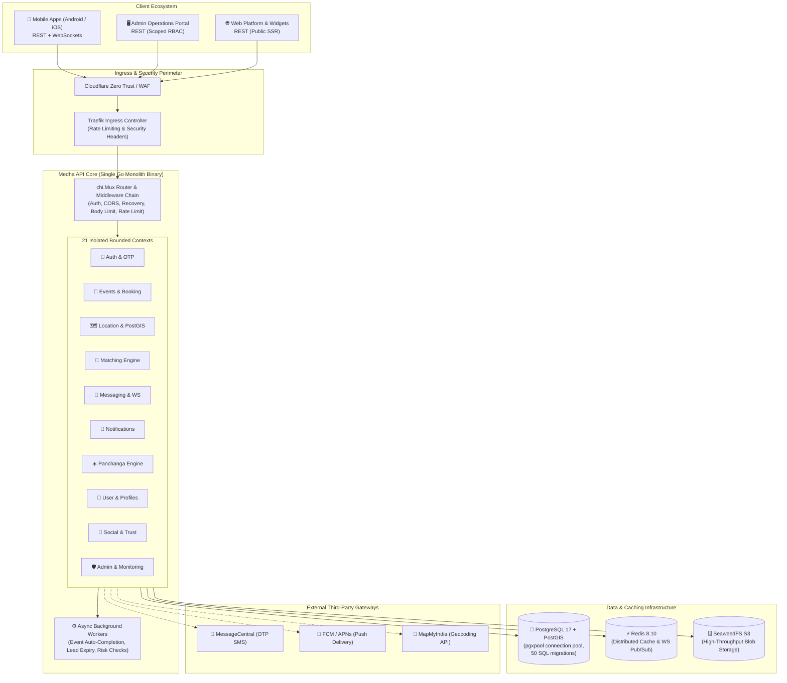

<div align="center">

# 🏛️ Medha Platform API
### Domain-Driven Modular Go Backend · PostGIS Proximity Engine · Distributed WebSocket Pub/Sub

[](https://github.com/vi-nayKR/medha-platform-api/actions/workflows/ci.yml)
[](https://go.dev/)
[](https://www.postgresql.org/)
[](https://redis.io/)
[](https://github.com/seaweedfs/seaweedfs)
[](https://docs.docker.com/compose/)
[](LICENSE)

**A domain-driven modular Go backend monolith engineered with 21 isolated bounded contexts, PostgreSQL/PostGIS geospatial queries, atomic database transaction propagation, Redis Pub/Sub WebSockets, and 50 automated SQL migrations.**

[System Architecture](#-system-architecture) • [Engineering Highlights](#-key-engineering-highlights) • [Bounded Contexts](#-bounded-context-catalog) • [Failure & Rollback Scenarios](#-booking-failure--transaction-rollback-scenarios) • [Quickstart](#-quickstart--local-development) • [Provenance & Attribution](#-snapshot-provenance--contribution-attribution)

---

</div>

## 📌 Executive Summary

**Medha Platform API** is an enterprise backend engineered for event scheduling, geospatial service discovery, real-time messaging, and multi-tenant operational management.

Rather than fragmenting operations across a sprawling microservice fleet with distributed network hops and complex two-phase commits, the platform uses a **Domain-Driven Modular Monolith** architecture. All 21 functional domains operate within a single compiled Go binary with strict 4-layer boundary isolation, atomic PostgreSQL transactions via `GetExecutor(ctx, pool)` and `WithTx`, and non-blocking asynchronous worker pools.

```
┌─────────────────────────────────────────────────────────────────────────────────┐
│                              SYSTEM ARCHITECTURE                                │
├───────────────────────┬─────────────────────────┬───────────────────────────────┤
│  🧱 Modular Monolith  │  📦 21 Bounded Contexts │  🗄️ 50 Goose Migrations       │
│  🗺️ PostGIS ST_DWithin│  💬 Redis Pub/Sub WS    │  🔒 JWT RS256 + RBAC Gate     │
└───────────────────────┴─────────────────────────┴───────────────────────────────┘
```

---

## 🏛️ System Architecture



---

## ⚡ Key Engineering Highlights

### 1. Strict 4-Layer Bounded Context Architecture
Every domain under `internal/<domain>/` is physically structured with zero cross-layer bypassing:
```
HTTP Request ──► [ Handler ] ──► [ Service ] ──► [ Repository ] ──► [ PostgreSQL / Redis ]
                    │               │                │
                    ▼               ▼                ▼
                 HTTP DTOs     Business Rules   SQL / Queries
```
- **Downward Dependencies Only:** A layer never imports past its adjacent layer.
- **Pure Interface Abstractions:** Hand-written test doubles enable exhaustive testing without complex mocking frameworks or slow runtime reflection.
- **Atomic Cross-Repository Transactions:** Every repository executes via `GetExecutor(ctx, pool)`, allowing a single database transaction (`pgx.Tx`) to span across multiple bounded contexts without leaky abstractions.
- **Setter Dependency Injection:** Cross-context relationships (e.g., `Event` → `Notification`) are wired in `cmd/medha-api/main.go` via explicit setter injection, eliminating circular import cycles.

### 2. High-Performance PostGIS Geospatial Engine
Location-sensitive queries compute real-time geographic proximity using PostgreSQL spatial geography functions:
```sql
-- High-throughput spatial proximity lookup with GIST spatial indexing
SELECT id, name, city, ST_Distance(location, ST_SetSRID(ST_MakePoint($1, $2), 4326)::geography) AS distance_meters
FROM service_providers
WHERE ST_DWithin(location, ST_SetSRID(ST_MakePoint($1, $2), 4326)::geography, $3)
  AND deleted_at IS NULL
ORDER BY distance_meters ASC
LIMIT $4 OFFSET $5;
```
- Custom spatial indices (`GIST (location)`) accelerate spatial bounding box filtering and distance calculations using PostgreSQL native spatial index operators.
- Keyset and offset pagination formats preserve linear query plans under high paging depth.

### 3. Distributed WebSocket Pub/Sub Fan-Out
Real-time messaging channels leverage a decoupled connection hub backed by Redis 8 Pub/Sub:
- Direct WebSocket connections authenticate via short-lived JWTs during the initial handshake.
- Ephemeral connection state is maintained in-memory on individual Go worker nodes (`sync.RWMutex` connection hubs).
- Multi-node broadcast messages are published to Redis channels (`msg:conv:{id}`), allowing any cluster pod to fan out messages to connected subscribers without localized affinity bottlenecks.

### 4. Resilient Fault-Tolerant Startup
The application runtime features dual-mode boot resilience:
- **Development Mode:** Missing external dependencies (Redis, S3 storage, or secondary databases) degrade gracefully. Non-essential handlers disable themselves, allowing localized feature development without running the entire cluster stack.
- **Production Mode:** Strict fail-fast assertion verifies database connectivity, migration schema version parity, S3 bucket existence, and JWT keypairs prior to serving traffic on port `:8080`.

### 5. RFC 7807 Compliant Error Contract
All API failure responses strictly conform to the **RFC 7807 (Problem Details for HTTP APIs)** specification:
```json
{
  "type": "https://api.medha.dev/errors/resource-not-found",
  "title": "Resource Not Found",
  "status": 404,
  "detail": "The requested ceremony schedule does not exist or has expired.",
  "instance": "/api/v2/events/e2222222-2222-2222-2222-222222222222",
  "code": "EVENT_NOT_FOUND",
  "timestamp": "2026-08-20T01:30:00Z"
}
```

---

## 📦 Bounded Context Catalog

| Domain | Package | Responsibilities & Core Interfaces |
| :--- | :--- | :--- |
| **Auth** | `internal/auth` | Phone-first OTP verification, JWT RS256 token issuance & refresh rotation, RBAC role gating. |
| **Events** | `internal/event` | Lifecycle state machines (Created $\rightarrow$ Matched $\rightarrow$ Assigned $\rightarrow$ Completed), booking workflows. |
| **Location** | `internal/location` | PostGIS spatial queries (`ST_DWithin`), MapMyIndia geocoding & reverse geocoding integration. |
| **Matching** | `internal/matching` | Multi-factor provider assignment algorithm, broadcast lead dispatch, timeout handlers. |
| **Messaging** | `internal/messaging` | Conversation threads, read receipts, real-time WebSocket messaging adapters. |
| **Notification** | `internal/notification` | Multi-channel delivery (FCM, APNs, SMS fallback), risk evaluation triggers. |
| **Panchanga** | `internal/panchanga` | Hindu astronomical almanac calculator (Tithi, Nakshatra, Yoga, Karana, Rahukalam, Gulikakalam). |
| **User & Profile**| `internal/user` | User account lifecycle, verified credential profiles, service city jurisdiction mapping. |
| **Social & Trust**| `internal/social` | Community activity feeds, reviews & ratings, trust scoring mechanisms. |
| **Storage** | `internal/storage` | S3-compatible multi-bucket file storage (SeaweedFS), presigned URL generation, SVG sanitization. |
| **Admin** | `internal/admin` | Operator monitoring dashboard, manual assignment overrides, runtime audit trails. |
| **Platform** | `internal/platform` | Worker thread pools, cron scheduler, epoch utilities, WebSocket connection hubs. |

---

---

## 🛡️ Booking Failure & Transaction Rollback Scenarios

The ceremony booking lifecycle represents the critical transactional core of the platform. It coordinates three bounded contexts: **Event**, **Matching**, and **Interest**. The implementation guards against concurrency anomalies, unauthorized state manipulation, and partial failure through transaction propagation and explicit state machines:

```
                  ┌─────────────────────────────────────────────────────────┐
                  │               Yajman Confirms Booking                  │
                  │              POST /api/v2/interest/{id}/book            │
                  └────────────────────────────┬────────────────────────────┘
                                               │
                                               ▼
                              ┌──────────────────────────────────┐
                              │  Ownership & Auth Gate Check     │
                              │  event.YajmanID == requesting_id │
                              └────────────────┬─────────────────┘
                                               │
                                   ┌───────────┴───────────┐
                            No     │                       │ Yes
                    ┌──────────────▼──────┐                ▼
                    │ 403 Forbidden       │     ┌─────────────────────┐
                    │ ErrNotEventOwner    │     │ State Gate Check    │
                    └─────────────────────┘     │ Status == Connected │
                                                └──────────┬──────────┘
                                                           │
                                               ┌───────────┴───────────┐
                                        No     │                       │ Yes
                                ┌──────────────▼──────┐                ▼
                                │ 400 Bad Request     │   ┌───────────────────────────────┐
                                │ ErrNotConnected     │   │  database.WithTx(ctx, pool)   │
                                └─────────────────────┘   └───────────────┬───────────────┘
                                                                          │
                                       ┌──────────────────────────────────┴──────────────────────────────────┐
                                       │                                                                     │
                                       ▼                                                                     ▼
                        ┌───────────────────────────────┐                                     ┌───────────────────────────────┐
                        │ Step 1: Interest -> Accepted  │                                     │ Step 2: Competing Leads       │
                        │ interest.Status = 'accepted'  │                                     │ BulkRejectByEventID(other_ids)│
                        └──────────────┬────────────────┘                                     └───────────────┬───────────────┘
                                       │                                                                      │
                                       └──────────────────────────────────┬───────────────────────────────────┘
                                                                          │
                                                                          ▼
                                                       ┌──────────────────────────────────────┐
                                                       │ Step 3: Event -> Booked              │
                                                       │ event.Status = 'booked'              │
                                                       └──────────────────┬───────────────────┘
                                                                          │
                                                      ┌───────────────────┴───────────────────┐
                                              Success │                                       │ Error / Disk Full / Lock
                                                      ▼                                       ▼
                                           ┌─────────────────────┐                 ┌─────────────────────┐
                                           │   COMMIT TX (200)   │                 │   ROLLBACK TX (500) │
                                           │ Async WS + Push     │                 │ Zero State Mutated  │
                                           └─────────────────────┘                 └─────────────────────┘
```

### 1. Authorization Failure Scenario (`ErrNotEventOwner`)
If a client attempts to accept an interest or confirm a booking on an event owned by another user:
- **Condition:** `event.YajmanID != caller.UserID`
- **Result:** Fails immediately with `domain.ErrNotEventOwner` before opening a database transaction.
- **HTTP Contract:** Returns `403 Forbidden` with RFC 7807 problem details:
  ```json
  {
    "type": "https://api.medha.dev/errors/forbidden",
    "title": "Forbidden",
    "status": 403,
    "detail": "You do not own this ceremony event.",
    "code": "NOT_EVENT_OWNER"
  }
  ```

### 2. Invalid State Machine Transition (`ErrInterestNotConnected`)
A booking can only be confirmed if the Pandit's interest has previously been reviewed and moved to `Connected`:
- **Condition:** `interest.Status != domain.InterestStatusConnected`
- **Result:** Fails with `domain.ErrInterestNotConnected`. Prevents direct booking of cold leads or already-rejected applicants.
- **HTTP Contract:** Returns `400 Bad Request` (`INTEREST_NOT_CONNECTED`).

### 3. Atomic Database Rollback (`database.WithTx`)
When confirming a booking, three separate tables across two bounded contexts must mutate atomically:
1. `interests.status` $\rightarrow$ `accepted`
2. All competing `interests` for that event $\rightarrow$ `rejected` (`BulkRejectByEventID`)
3. `events.status` $\rightarrow$ `booked`

If an error occurs during step 3 (e.g., database network partition, deadlocks, or constraint violation):
- `WithTx` intercepts the error and executes `defer tx.Rollback(ctx)`.
- **Guarantee:** None of the competing Pandits are rejected, the primary Pandit's interest remains `connected`, and the event remains `active`.
- Proven in deterministic CI tests: `TestInterestService_ConfirmBooking_AtomicRollbackOnEventUpdateFailure`.

---

## 🚀 Quickstart & Local Development

### Prerequisites
- **Go:** `1.25+` (or `1.24+`)
- **Docker & Docker Compose:** `v2.20+` (optional for local database)
- **Goose:** `v3.24+` (optional for migrations)

### 1. Clone & Configure Environment
```bash
git clone https://github.com/vi-nayKR/medha-platform-api.git
cd medha-platform-api

# Copy example environment configuration
cp .env.example .env
```

### 2. Run the API Server (Immediate Dev Mode)
The server features **resilient dual-mode startup**. In development mode (`ENVIRONMENT=development`), the application starts immediately even if PostgreSQL, Redis, or S3 are not running locally:
```bash
# Build and run the single binary
go run ./cmd/medha-api/main.go
```
The server will initialize on `http://localhost:8080`. Verify system health:
```bash
curl -i http://localhost:8080/health
```

### 3. Full Infrastructure Stack (PostgreSQL 17 + PostGIS + Redis)
To run the complete data tier with PostGIS geospatial queries and migrations:
```bash
# Start PostgreSQL 17 + PostGIS and Redis 8
docker compose up -d postgres redis

# Run all 50 SQL migrations in sequence
make migrate-up

# Start API with full database support
make run
```

---

## 🧪 Testing & Code Quality

The entire domain test suite runs with hand-written repository test doubles, eliminating the need for Docker or running database containers during CI test execution:

```bash
# Run all unit & integration tests with race detector
go test -race -v ./...

# Run transaction-specific tests
go test -race -v ./internal/infra/database/... ./internal/interest/service/...

# Build production binary
CGO_ENABLED=0 go build -v -o bin/medha-api ./cmd/medha-api
```

---

## 📊 Verification & Benchmark Boundaries

- **Unit & Race Test Coverage:** All 21 bounded contexts (Auth, Events, Matching, Interests, Notifications, Messaging, Panchanga, Social, Admin, Storage, Location) pass under the Go race condition detector (`go test -race ./...`).
- **Transaction Safety:** Repository operations use `GetExecutor(ctx, pool)` to ensure atomic transactional participation across bounded contexts.
- **Benchmark Disclosure:** Preliminary throughput and latency figures (e.g., 500 RPS / 780 RPS) reported in early design notes represent historical internal simulation targets. They are not published production service level agreements and will be updated when committed, reproducible benchmark harnesses are checked in.
- **Architecture Scalability Ceiling:** In the single-node modular monolith topology, PostgreSQL acts as the single primary writer. Real-time chat messaging and high-frequency geolocation updates are isolated as the primary candidates for read replica offloading or service extraction under sustained write pressure.

---

## 👥 Snapshot Provenance & Contribution Attribution

### Repository Provenance
- **Snapshot Origin:** Exported from the collaborative product backend repository `medha-innovations/medha-api` (`dev` branch, commit baseline `cf75ee8`).
- **Sanitization:** Internal domains have been sanitized to `medha.dev` (`api.medha.dev`, `admin.medha.dev`, `support.medha.dev`). Production credentials, secrets, and private signing keys are excluded; `.env.example` provides complete development configuration keys.
- **Deployment Topology:** The initial infrastructure baseline documented in `medha-platform-infra` utilized Kubernetes (k3s) and ArgoCD manifests. The running operational topology was subsequently transitioned to a two-node Docker Compose architecture for operational simplicity and cost efficiency.

### Contribution Ownership
- **Vinay K R** ([@vi-nayKR](https://github.com/vi-nayKR)) — *Co-Architect & Core Backend Engineer*:
  - Designed the 21-domain modular monolith architecture and 4-layer boundary isolation (`domain/service/repository/handler`).
  - Authored the transaction propagation framework (`GetExecutor(ctx, pool)` and `WithTx`).
  - Engineered PostGIS spatial proximity queries (`ST_DWithin` with GIST index acceleration) and keyset pagination.
  - Built the JWT RS256 authentication and scoped role-based access control (RBAC) middleware.
  - Implemented the decoupled Redis 8 Pub/Sub WebSocket connection hub (`platform/ws`) and real-time messaging pipeline.
  - Implemented event lifecycle and multi-party booking state machines (`Event` $\rightarrow$ `Matching` $\rightarrow$ `Interest`).
  - Standardized RFC 7807 error problem contracts across all HTTP endpoints.
- **Koushik H R** ([@koushik-hr](https://github.com/koushikhr)) — *Co-Architect & Infrastructure Engineer*:
  - Co-architected infrastructure operations, Docker Compose & k3s deployment pipelines, mobile client applications (Android / iOS), and admin dashboard integration.

---

## 📄 License

This project is licensed under the MIT License — see the [LICENSE](LICENSE) file for details.
