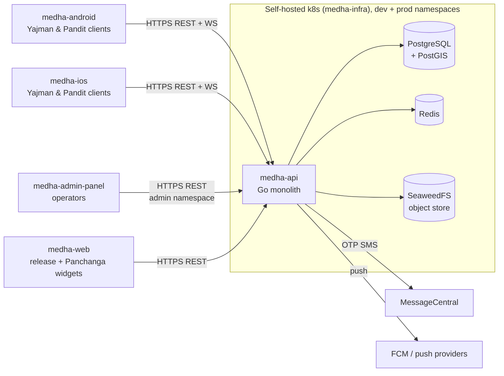

# Medha API — Architecture

**Scope.** This document describes the API service *as built* — its runtime shape, layers, bounded
contexts, data stores, and how a request flows through them. For *why* it is designed this way
(goals, trade-offs, quality attributes, failure modes), see [`system_design.md`](./system_design.md).
For working conventions and commands, see [`AGENTS.md`](./AGENTS.md).

---

## 1. Context: role in the Medha platform



`medha-api` builds a container image; [`medha-infra`](../medha-infra) decides where it runs and
which hostnames reach it. As of 2026-07-22, the same `db5827f` API image is pinned in both the dev
and production overlays, completing the end-to-end backend rollout. `medha-ios` remains under
incremental polish; it does not require a different backend topology.

## 2. Process & runtime model

A **single Go binary** (`cmd/medha-api/main.go`). Startup sequence:

1. Load configuration (`internal/config`) from environment / `.env`.
2. Connect **Postgres** (`pgxpool`), **Redis**, and **S3-compatible storage (SeaweedFS)** with retry logic.
3. Construct every bounded context (repositories → services → handlers).
4. Wire cross-context dependencies via **setter injection** (avoids import cycles).
5. Start background goroutines (event auto-completion, lead expiry, risk checker).
6. Call `server.SetupRouter(...)` (chi) and listen.

**Nil-safe startup.** In development, a missing DB/Redis/S3 storage **degrades gracefully** — the
affected handlers stay `nil` and their features disable, rather than crashing. In production,
missing infrastructure is a **fatal exit**. Handler nil-guards are load-bearing; do not remove them.

## 3. Layered bounded-context architecture

Business logic is organized into **bounded contexts** under `internal/<domain>/`, each with four
strictly separated layers. Dependencies point **downward only**; a layer never reaches past its
neighbor.

```
            HTTP request
                │
         ┌──────▼───────┐   decode → validate DTO → call service → write envelope
         │   handler/   │   (thin; go-playground/validator; RFC 7807 on error)
         └──────┬───────┘
         ┌──────▼───────┐   business workflows; orchestrates repositories;
         │   service/   │   owns transactions; cross-context calls via injected deps
         └──────┬───────┘
         ┌──────▼───────┐   postgres_*.go — parameterized SQL only;
         │ repository/  │   implements interfaces declared in domain/
         └──────┬───────┘
         ┌──────▼───────┐   entities, ErrXxx sentinel errors, repository interfaces
         │   domain/    │   (no imports from repository/service/handler)
         └──────────────┘
```

**Why interfaces live in `domain/`:** the service depends on an interface, the `repository/`
implementation satisfies it. This keeps SQL swappable and lets tests substitute hand-written fakes
without a mocking framework.

## 4. Domain map

| Context | Owns |
| --- | --- |
| `auth` | OTP request/verify, JWT RS256 issue/refresh, session boundaries |
| `user` | Yajman & Pandit profiles, onboarding, roles |
| `event` | Ceremony/booking lifecycle, auto-completion |
| `matching` | Pandit↔Yajman matching, leads, lead expiry |
| `interest` | Expressions of interest between parties |
| `messaging` | Conversations & messages (real-time via `platform/ws`) |
| `notification` / `push` | In-app notifications and device push |
| `social` / `story` | Feed content and stories, trust/risk signals |
| `panchanga` | Hindu calendar / astronomical data |
| `city` / `location` | Geographic reference data (PostGIS) |
| `storage` | Media upload/serve via S3-compatible storage (SeaweedFS) |
| `festivallogos` / `apprelease` / `systempublisher` | Assets, app-release metadata, publishing |
| `admin` | Operator-facing endpoints consumed by medha-admin-panel |

## 5. Shared infrastructure & platform

- `internal/infra/database` — `pgxpool` + **`GetExecutor(ctx, pool)`**, the transaction-aware
  executor every repository must use.
- `internal/infra/cache` — Redis client (sessions/rate-limit/pub-sub backing).
- `internal/infra/storage` — S3-compatible object storage (SeaweedFS).
- `internal/platform/ws` — WebSocket **hub** fanned out across instances via **Redis pub/sub**.
- `internal/platform/worker` — async worker pool + background workers.
- `internal/platform/messagecentral` — OTP SMS provider integration.
- `internal/platform/epoch` — time/epoch helpers.
- `internal/server` — chi router + `middleware/` (auth, cors, logging, rate_limit, recovery,
  request_id).
- `pkg/` — `crypto`, `response` (standard wrapped success envelope), `errors` (RFC 7807 Problem
  Details), `image`.

## 6. HTTP & API layer

- **Router:** `github.com/go-chi/chi/v5`. **DB driver:** `pgx/v5`.
- **Success responses** use the wrapped envelope in `pkg/response`; **errors** are RFC 7807 Problem
  Details from `pkg/errors`. Driver/SQL errors are never surfaced to clients.
- **Middleware chain:** request ID → logging → recovery → CORS → rate limit → auth.
- **Spec:** OpenAPI in `api/openapi/` (served at `/api/docs` when running); Bruno and Postman
  collections are generated via `make swagger` and reviewed as source.

## 7. Real-time & background processing

- **WebSocket:** `platform/ws` maintains per-instance connection hubs and bridges them over Redis
  pub/sub so a message published on one pod reaches subscribers on another. Handshake auth uses the
  `?token=` query parameter (see [`AGENTS.md` §7](./AGENTS.md)).
- **Background jobs** run as goroutines started in `main.go`: event auto-completion, matching lead
  expiry, and a risk/trust checker. Longer async work uses `platform/worker`.

## 8. Data model & storage

- **PostgreSQL + PostGIS** is the system of record. Schema evolves via **goose** migrations in
  `migrations/` (~49). Soft-deletable tables carry `deleted_at`; queries filter `deleted_at IS NULL`.
- **Redis** backs sessions, rate limiting, and WebSocket pub/sub.
- **SeaweedFS** (S3-compatible) stores user/media objects, fronted by `internal/storage`.

## 9. Cross-cutting concerns

| Concern | Where |
| --- | --- |
| Config & environment gating | `internal/config` (`IsDevelopment()` / `IsProduction()`) |
| AuthN/Z | JWT RS256; middleware in `internal/server/middleware`; WS token in query param |
| Error contract | `pkg/errors` (RFC 7807) at handler boundary |
| Transactions | `database.GetExecutor(ctx, pool)` |
| Observability | structured logging + request IDs via middleware |

## 10. Deployment topology

Image built from `cmd/medha-api` → pushed to the cluster registry → run by `medha-infra` as the
`backend` Deployment in the `dev` and `prod` namespaces. Postgres/Redis/SeaweedFS run as StatefulSets in
the same namespace. Ingress is Traefik behind a Cloudflare tunnel. Migrations apply via
`medha-api -migrate` on release. See [`medha-infra/architecture.md`](../medha-infra/architecture.md).

## 11. Directory map (quick reference)

| Path | Purpose |
| --- | --- |
| `cmd/medha-api/` | main entry point |
| `cmd/{deploy,genkeys,sync-bruno,sync-postman,utils}/` | ops & generator tools |
| `internal/<domain>/` | bounded contexts (`domain`/`repository`/`service`/`handler`) |
| `internal/{infra,platform,server,config}/` | shared infra, platform services, HTTP wiring, config |
| `pkg/` | reusable libs (`crypto`, `response`, `errors`, `image`) |
| `migrations/` | goose SQL migrations |
| `api/openapi/` | OpenAPI spec + generated docs |
